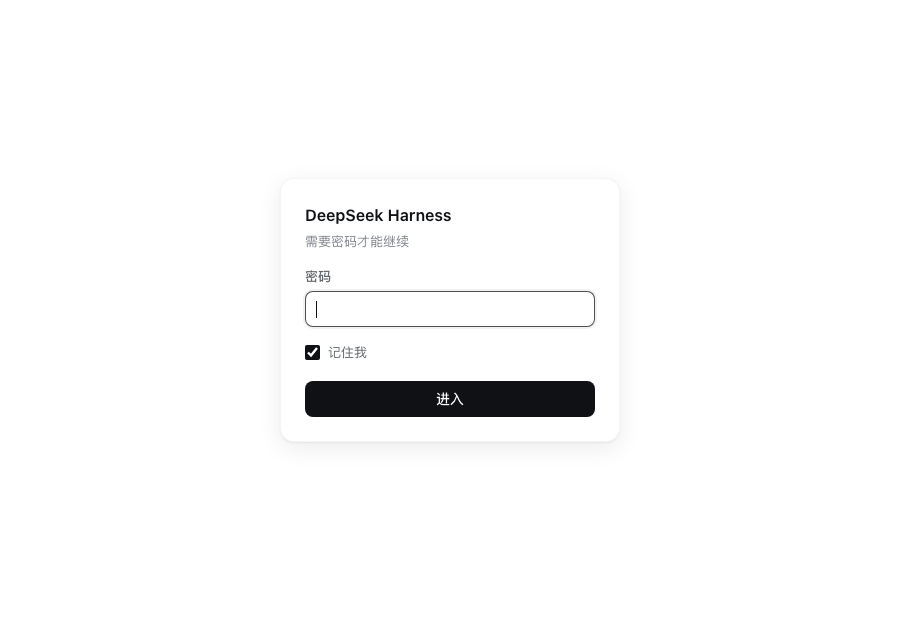
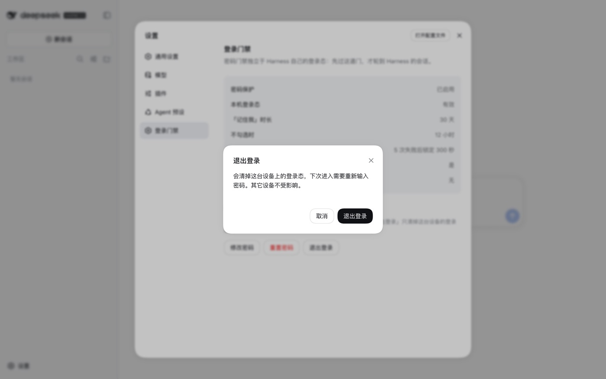
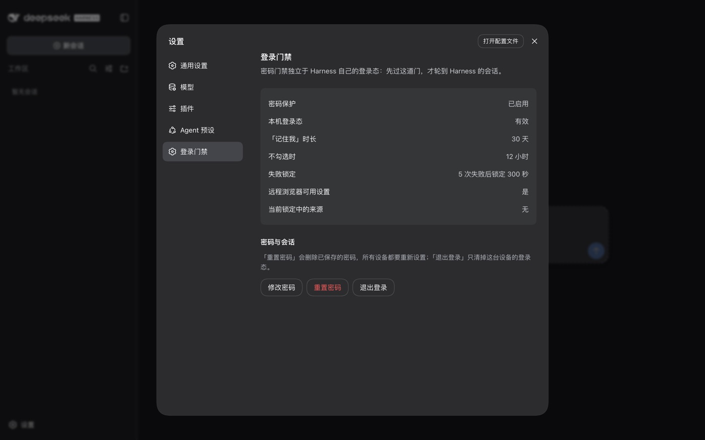

# dsh-web-login

[中文](README.zh-CN.md) · English

An independent password gate for the DeepSeek Harness Web GUI.

Zero-dependency Cordis plugin. Takes over `/` and `/index.html`: a request that has not passed verification is not forwarded to Harness, and the launch token is not handed out. Harness's own authentication and `/api/*` are unaffected.



## Features

- **First-run setup** — the password is set on first visit and verified against a one-time token printed at startup, so a public scanner cannot claim the instance first
- **Sessions** — "Remember me" lasts 30 days, 12 hours otherwise; both configurable
- **Lockout** — 5 consecutive failures from one source lock it out for 300 seconds, counted per real client IP
- **Audit log** — records sign-ins, password changes, lockouts and sign-outs, never the password itself
- **Management UI** — a page inside Harness's own settings for changing the password, resetting it, and signing out
- **Credential storage** — scrypt-salted password hash; the session cookie is HMAC-SHA256 signed and bound to the host

## Install

Requires pnpm. dsh does not bundle it; without pnpm the install command fails with `pnpm was not found` and leaves the profile unchanged.

```bash
npm i -g pnpm
dsh plugin --profile web add git+https://github.com/liyang52520/dsh-web-login.git
```

The package declares `dsh.bundle`, so dsh registers it under `dsh.profile.bundles` automatically. No configuration file needs editing.

Restart dsh to load the plugin. Under systemd that is `systemctl restart dsh`.

Maintenance:

```bash
dsh plugin --profile web update dsh-web-login    # upgrade
dsh plugin --profile web remove dsh-web-login    # uninstall
```

`DSH_HOME` must match the running instance (default `~/.dsh`). With any other path the command still succeeds, but installs into a different profile and has no effect on the running instance.

<details>
<summary>Manual install (without dsh plugin)</summary>

Via pnpm:

```bash
cd "${DSH_HOME:-$HOME/.dsh}/profiles/web"
pnpm add 'github:liyang52520/dsh-web-login'

grep -q web-login cordis.patch.yml 2>/dev/null || cat >> cordis.patch.yml <<'EOF'
- insert:
    - id: web-login
      name: dsh-web-login
EOF
```

Without pnpm, copy the tracked files instead and write the same `insert` block:

```bash
git clone https://github.com/liyang52520/dsh-web-login.git /opt/dsh-web-login
PROFILE="${DSH_HOME:-$HOME/.dsh}/profiles/web"
mkdir -p "$PROFILE/node_modules/dsh-web-login"
git -C /opt/dsh-web-login archive HEAD | tar -x -C "$PROFILE/node_modules/dsh-web-login"
```

The two mounting methods must not be combined: a bundle and an `insert` row each produce a `web-login` entry, and the duplicate id prevents the configuration tree from loading.

</details>

## Usage

### First-run setup

dsh prints a one-time setup token at startup:

```
dsh web-login: setup-token: 7rJfiimRBtBZbZZqbEY3_O6VBO3Te-bA
```

Where to find it depends on the deployment: `journalctl -u dsh` under systemd, the terminal for a foreground run, `docker logs` in a container.

Visit the site, enter the token and set a password.

### Management UI

Once signed in, the gate is managed from **Settings → 登录门禁** (Login Gate) inside Harness. A Chinese label is expected at present; see [Interface language](#interface-language).



| Action | Effect |
|---|---|
| Change password | Verifies the current password, then sets a new one; rotates the signing key, invalidating sessions on other devices |
| Reset password | Deletes the stored password; every device must run first-run setup again |
| Sign out | Clears this device's session only |

The panel follows Harness's theme setting.



### Local agents and automation

An agent running on the host cannot get past the gate by spoofing `Host`, and no `--trusted-host` value changes that: the gate admits a signed cookie bound to the authority, and the Host/Origin fence it consults afterwards sits behind the gate. Letting a local process through is an explicit choice:

```yaml
- id: web-login
  config:
    trustDirectLoopback: true
```

With it on, a request that arrives **directly on the loopback socket** and carries none of the headers a reverse proxy adds — the configured `clientIpHeader`, `x-real-ip`, `x-forwarded-for` — is treated as already verified. `curl http://127.0.0.1:3080/` then returns the application document, and a headless browser opens the interface already signed in: reaching the document is what makes Harness mint its own session, so no token exchange is needed on the agent's side.

It only takes effect once a password exists, so it cannot spend the first-run setup token. It also opens the document route alone: the login form, the account route and the plugin's `/__api/*` surface still require the cookie.

Three consequences to accept before enabling it:

- **An SSH tunnel is also a direct loopback connection.** `ssh -L 3080:127.0.0.1:3080` arrives from the host itself, so tunnel users no longer need the password.
- **Anyone on the host is admitted**, not only the account running dsh.
- **A deployment change silently disarms the gate.** If the port is ever bound publicly, or the upstream proxy stops adding those headers, every remote request looks local. The plugin prints this warning at startup whenever the option is on.

The narrower alternative is to leave the option off and give the agent the password: POST it to `/__login`, keep the `dsh_gate` cookie, and reuse it. A dedicated token on the same loopback rule is a possible future addition.

## Configuration

Configuration is written to the profile's `cordis.patch.yml`:

```yaml
- id: web-login
  config:
    title: My Harness
    rememberDays: 7
```

`config` is replaced as a whole; unlisted keys keep their defaults.

| Key | Default | Description |
|---|---|---|
| `enabled` | `true` | Set to `false` to take over no routes at all |
| `title` | `"DeepSeek Harness"` | Page title and login page heading |
| `passwordMinLength` | `8` | Minimum password length |
| `rememberDays` | `30` | Session lifetime when "Remember me" is checked |
| `sessionHours` | `12` | Session lifetime otherwise |
| `maxFailures` | `5` | Consecutive failures before a lockout |
| `lockoutSeconds` | `300` | Lockout duration in seconds |
| `clientIpHeader` | `"x-real-ip"` | Header used to obtain the real client IP; determines what the rate limit counts |
| `allowLoopbackSetup` | `false` | Allow loopback addresses to set a password without the setup token |
| `trustDirectLoopback` | `false` | Treat a proxy-free loopback connection as verified; see "Local agents and automation" |
| `indexHtml` | `""` | Explicit path to the frontend `index.html` |
| `unlockRemoteSettings` | `true` | Allow remote browsers to change settings; see "Settings are read-only" |
| `pageTheme` | `"auto"` | Login page colour scheme: `auto` / `light` / `dark` |

## Troubleshooting

### Signed in, but requests return 403

Harness's Host/Origin check does not cover the hostname in use. On first encountering this, the plugin prints the required configuration and shows the Host Harness actually received:

```
dsh web-login: 1) 给 dsh 声明这个主机：--trusted-host harness.example
dsh web-login: 2) 让反向代理透传真实 Host 与 Origin：
dsh web-login:      proxy_set_header Host   $http_host;
dsh web-login:      proxy_set_header Origin $http_origin;
```

Step 1 is always required; step 2 applies only when access goes through a reverse proxy.

### Settings are read-only, reporting "settings are unavailable in this browser"

Harness permits only loopback browsers to change settings. Access over a loopback address or an SSH tunnel counts as loopback; access from the public internet through a reverse proxy does not, so the settings page is read-only, shows that message, and the welcome notice reappears on every reload.

The plugin treats password-verified remote browsers as loopback by default (`unlockRemoteSettings: true`), which restores normal settings access. Set it to `false` to disable that behaviour.

### Forgot the password

Stop the service, delete the `dsh-web-login/state` block from `$DSH_HOME/.credentials.yaml`, and restart. The next visit runs first-run setup again:

```yaml
dsh-web-login/state:        # delete this block and everything under it
  kind: grant
  payload:
    version: 1
    algorithm: scrypt
```

### Audit log

Audit records go to dsh's standard output, one line each, prefixed with `dsh web-login: audit`. Under systemd:

```bash
journalctl -u dsh --no-pager | grep 'dsh web-login: audit'
```

Event types: `password-set`, `login-ok`, `login-failed`, `password-changed`, `password-change-failed`, `password-reset`, `reset-failed`, `setup-token-failed`, `lockout`, `logout`, `fence-rejected`, `api-cross-origin-rejected`. Failure events carry a running count.

## Security

**Defended against**: scanners, botnets, and third parties who obtain the URL but are not on the network path. Such access sees only the login page and cannot call `/api`.

**Not defended against an on-path eavesdropper**: over plain HTTP the password and cookies travel in the clear. This is a limitation of the protocol, not of the plugin. Where possible, an SSH tunnel is preferable to exposing the port, and requires neither a domain nor a certificate:

```bash
ssh -N -L 3080:127.0.0.1:3080 user@<server>
# then open http://127.0.0.1:3080/ locally
```

The port is then not exposed publicly, and the plugin still applies. Other known boundaries:

- The password is stored as a scrypt hash (N=16384, r=8, p=1) in `$DSH_HOME/.credentials.yaml`, mode 0600
- The session cookie is HMAC-SHA256 signed and bound to the host in use; another hostname or a forged cookie is rejected
- Rate-limit state is held in memory and cleared on restart; it defends against single-source brute force, not distributed slow attacks, but every failure is written to the audit log
- Changing the password rotates the signing key, immediately invalidating sessions on other devices
- `trustDirectLoopback` moves the boundary from "who you are" to "how you connected": see "Local agents and automation" for what it gives up
- The plugin has full access to the host process. Use only versions you have reviewed

## Interface language

All gate strings are currently Chinese, in the login and setup pages and in the settings panel. An English interface is not implemented; the screenshots above show the Chinese text. `pageTheme` selects the colour scheme only.

## Development

```bash
npm test        # node:test, no dependencies
```

Covers password hashing and verification, cookie signing (replay, tampering, cross-host, expiry), rate limiting and per-address lockout isolation, hostname normalisation, configuration validation, and the browser half's module envelope, slot registration and rendered output.

The browser half `client.js` is a hand-written `window.__ModuleLoader__.load` envelope. No bundler is required, and its only runtime import is `react`.

## Compatibility

| dsh version | Status |
|---|---|
| `0.2.0-rc.2` | Verified in production (Linux + nginx) |
| `0.1.2-rc.1` | Development and testing (macOS) |

The Harness services used are `connection.authorizeIndex()`, `connection.authenticatedUrl()` and `connection.requestRejection()`, plus the `webServer` exact-route registration and the `credentials` record API.

## License

MIT © liyang52520
